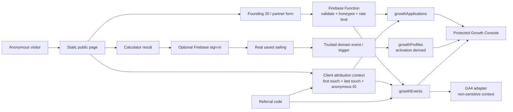

# CruiseKit Growth Engine V1 Plan

Status: implemented on the Growth Engine V1 feature branch; not deployed. This document records the shipped architecture without claiming that the routes, collections, events, or console are live in production.

## Objective

Acquire, onboard, activate, and learn from the first 20 real CruiseKit users without overbuilding for later scale.

An activated user is a person who has both:

1. Saved or submitted a real upcoming sailing; and
2. Completed at least one qualifying value action: a true-cost calculation, budget update, spend action, port/day plan, MyCrew invitation sent or accepted, or real MyDay use.

Downloads, page views, and email submissions alone are not activation.

## Existing Architecture

| Area | Current foundation | V1 integration decision |
| --- | --- | --- |
| Public web | Next.js 16 static export in `apps/web`, deployed to GitHub Pages | Keep the existing app and mobile-first design system. Do not add Next.js API routes or SSR dependencies. |
| Hosting | GitHub Pages serves `apps/web/out` | Public pages are static. Browser-to-backend work goes to Firebase, not the static host. |
| Authentication | Firebase Authentication, Google sign-in | Do not require sign-in for calculator results or public applications. Link a known Firebase UID only after sign-in. |
| Database | Cloud Firestore with default-deny rules | Keep private growth data server-written or admin-only. Extend rules only when a client read/write is truly needed. |
| Server work | Firebase Cloud Functions v2 with Admin SDK | Use callable/HTTP Functions for public submissions, admin operations, rate limits, referral resolution, and trusted activation updates. |
| Email | Resend adapter in `functions/index.js` | Reuse only for purpose-specific Founding 20 confirmation/follow-up after consent and configuration review. |
| Analytics | GA4 loader and `apps/web/lib/analytics.ts` wrapper | Extend the wrapper into a vendor-agnostic event interface while preserving GA4 as the first adapter. |
| App handoff | Saved-cruise handoff and iOS Universal Links | Preserve `/cruise/handoff` and `/mycrew/join`; Android Digital Asset Links need separate verification. |
| Mobile product actions | MyDay, Spend, and much of MyCrew live in the external Flutter repository | Define a shared event contract. Do not infer mobile actions from public-page views. |

The static-host constraint is material: a Founding 20 form cannot safely depend on a Next.js route handler. It must call a Firebase Function, which validates, rate-limits, and writes with the Admin SDK.

## Proposed Routes

| Route | Purpose | Notes |
| --- | --- | --- |
| `/calculator` | Existing public true-cost calculator | Keep as the canonical calculator route. A `/tools/true-cruise-cost` alias is optional, not a replacement. |
| `/founding-20` | Founding 20 explanation and application | Static page plus client form calling a public Firebase Function. |
| `/captains` | Sailing Captain recruitment and application | Must not promise payment or revenue share. |
| `/advisors` | Travel Advisor recruitment and application | Must say CruiseKit does not replace advisors. |
| `/creators` | Creator recruitment and application | Lead with useful planning content, not a generic app advertisement. |
| `/r/[code]` | Referral landing/resolution | Static-route-compatible redirect/landing behavior backed by a callable/HTTP resolver or prebuilt static page strategy. Do not expose sequential IDs. |
| `/internal/growth` | Protected Growth Console | Reuse the `adminUsers/{uid}` authorization model; do not rely only on a build-time route flag. |

## Proposed Data Model

Names below are proposed. Final field names must be centralized in types and validated server-side before implementation.

| Collection | Purpose | Read/write policy |
| --- | --- | --- |
| `growthApplications/{id}` | Founding 20 and partner applications, program status, follow-up, founder notes | Public submissions through a Function only; admins through protected Functions or narrowly scoped admin rules. |
| `growthProfiles/{id}` | Pseudonymous growth identity, linked UID when available, current activation state | Server-written only. Use a random profile ID or Firebase UID; never use email as a document ID. |
| `growthEvents/{id}` | Minimal durable product/funnel event ledger for activation and console counts | Server-written only. Keep PII out of event properties. |
| `referralCodes/{code}` | Opaque referral code, type, active/revoked state, owner reference, created/revoked timestamps | Resolver/admin only; code must be random and non-sequential. |
| `growthRateLimits/{key}` | Short-lived, hashed abuse-control counters | Function-only. Store no raw IP address. |

`growthApplications` should separate contact information from product context and attribution. Required consent should include a boolean, server timestamp, disclosure/version, and source. Founder notes must never be sent to GA4 or referral partners.

## Data Flow



## Integration Approach

### Public forms

Each form uses accessible client validation for fast feedback, but the Firebase Function is authoritative. The Function must validate allowed fields, trim/sanitize strings, enforce length and enum limits, reject a filled honeypot, apply a privacy-preserving rate limit, and return a generic success state that says the application was received—not accepted.

The calculator remains usable without registration. Saving a sailing requests sign-in only when persistence is requested. A generic calculator snapshot or fabricated future date must not be counted as a real sailing save.

### Attribution and referrals

Capture `utm_source`, `utm_medium`, `utm_campaign`, `utm_content`, `utm_term`, `ref`, and `referral_code` on all public entry pages. Persist first touch immutably and refresh last touch on eligible later visits. Carry context through calculator completion, applications, authentication, saved sailings, store clicks, and MyCrew actions.

Referral codes support founding user, sailing captain, cruise creator, travel advisor, community administrator, and internal campaign. Codes are unique, revocable, random, and attributable. QR generation may use a lightweight dependency only after code resolution is implemented and tested.

### Activation

Activation is a derived server-side state, not a GA4 conversion flag:

```text
activated = real_upcoming_sailing_saved
            AND exists(qualifying_value_event)
```

The server records the activation timestamp and triggering action exactly once. The qualifying action list and identity rules are defined in [ANALYTICS_SPEC.md](ANALYTICS_SPEC.md).

### Growth Console

Reuse the existing Firebase admin marker pattern, but keep Growth Engine records separate from `dealLeadRequests`. The console needs the Founding 20 status pipeline, filters, private notes, follow-up date, CSV export, funnel metrics, and a visible small-sample warning. It may reuse visual patterns from `/internal/leads` without inheriting its deal-lead statuses or customer data shape.

## Analytics

GA4 is the configured analytics destination today. V1 adds a provider-neutral `track()` interface so domain code does not depend directly on `gtag`. GA4 receives only the allowed event context; durable conversion and activation state live in Firestore through trusted paths.

The complete event taxonomy, property rules, compatibility mapping, and activation logic are in [ANALYTICS_SPEC.md](ANALYTICS_SPEC.md).

## Privacy and Data Deletion

- Collect only the form fields stated for the program.
- Do not send email, phone, private notes, cabin details, full payment data, or sensitive location history to analytics.
- Contact consent is limited to the specific program; it is not blanket marketing consent.
- Do not add broad marketing email capture or automated campaigns without a reviewed consent, unsubscribe, retention, and provider plan.
- Existing account deletion requests go to `info@cruisekit.app`. V1 must document the same manual path for unauthenticated applications and define the collections that operations staff must remove.
- Public referral reporting is aggregate only. Never disclose private sailing, spend, invitation, or identity data to partners.

## Testing Strategy

| Layer | Required coverage |
| --- | --- |
| Calculator unit tests | All totals, zero values, traveler counts, day counts, percentage safety, and newly added manual cost categories. |
| Function tests | Form validation, consent, honeypot, rate-limit behavior, referral resolution, admin authorization, and deletion request handling. |
| Firestore rules tests | Any new client-readable/admin-readable collection, cross-user access, unauthenticated access, and immutable captured fields. |
| Integration tests | Attribution persistence from landing through form/save, sign-in identity linking, and activation derivation. |
| E2E test | UTM/referral arrival -> calculator -> result -> Founding 20 application or real sailing save -> qualifying action -> activation -> console -> invitation/referral preservation. |
| Manual QA | Mobile viewport, keyboard navigation, screen-reader labels/errors, loading/empty/error states, and GA4 live-event validation. |

## Known Blockers and Configuration Gaps

1. The repository has only a production Firebase project alias (`cruisekit-app`); no staging Firebase project/alias is configured.
2. GitHub Actions deploys the static site only. Firebase Functions and Firestore rules require an approved, separate deployment command.
3. App Check is not currently enabled. Public traffic needs a documented abuse-control decision before broad promotion.
4. The Functions deployment needs distinct high-entropy `GROWTH_RATE_LIMIT_SECRET` and `GROWTH_IDENTITY_SECRET` values, plus an operations-side Firestore TTL policy for `growthRateLimits.expiresAt`.
5. Resend domain/secret readiness must be verified before any automated application email is enabled. The product must still store an application safely if optional email configuration is unavailable.
6. Real MyDay, Spend, and some MyCrew actions are outside this repository, so their event instrumentation requires coordinated mobile work.
7. Current calculator fare estimates and result freshness messaging need source/date review before using them as public defaults.
8. Outreach, paid promotion, deployment, production data writes, and public claims remain subject to Kali approval.

## Explicitly Deferred

- Payment, subscription, referral payouts, revenue share, or pricing changes
- Enterprise experimentation, multivariate testing, or significance claims from the first 20 users
- CRM synchronization and automated partner dashboards
- Broad email marketing or newsletters
- Public co-branding beyond approved links
- New booking, affiliate, or cruise-price claims
- Android App Links until the mobile package and hosting verification are available

## Local and Deployment Commands

Local validation after implementation:

```bash
pnpm --filter web lint
pnpm --filter web exec tsc --noEmit
pnpm functions:lint
pnpm test:rules
pnpm --filter web build
```

E2E commands must be added with the chosen Playwright configuration. Do not deploy directly to production without explicit approval. See [LAUNCH_CHECKLIST.md](LAUNCH_CHECKLIST.md) for the staged deployment sequence and the current staging-project blocker.
